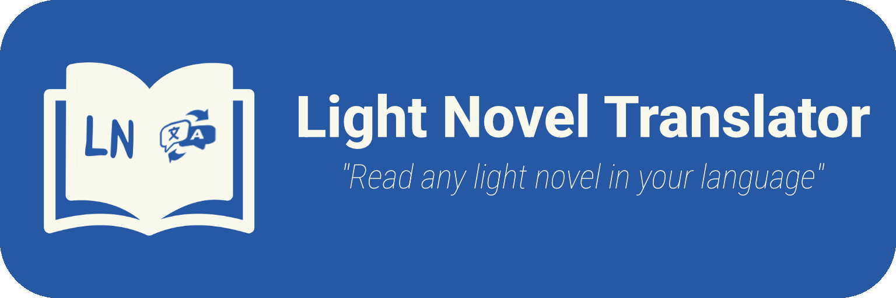

  

# LN Translator

Translate Japanese Light Novels directly from official websites to your preferred language with ease. This tool is designed to provide a seamless reading experience for LN fans, removing the language barrier directly on your screen.

  

## Demo

https://github.com/user-attachments/assets/8ef0d227-eac6-4fd6-b907-974a7469fa7d

## Get Started

1. **Get your API Key**: Obtain your free API keys from [Google AI Studio](https://aistudio.google.com/app/apikey).
2. **API Setup**: Open the app, go to Settings, and add your Gemini API keys. **Privacy Note**: Your keys are stored locally and used *only* to communicate with Google's API. No third party or developer has access to your credentials.
3. **Start Translator**: Tap the "Start Translator" button on the home screen. Ensure you allow the "Display over other apps" and "Screen recording" permissions when prompted.
4. **Screen Capture**: When the Android permission dialog appears, we recommend choosing **"Share one app"** and then selecting your target reading app (e.g., BookWalker, Kindle, or Browser).
5. **Context (Optional)**: Input your preferred context in the home screen (e.g., "maintaining a medieval fantasy tone") to guide the translation style.
6. **Translate**: Tap the floating icon to start translating your current page!

## Translation Providers

The app currently offers two main ways to translate your screen:
- **Gemini (Vision)**: Sends the captured image directly to the model for a highly contextual translation.
- **Gemini (OCR + Text)**: Extracts the Japanese text locally using OCR first, then sends the clean text to the model for translation.
- **Coming Soon**: Integration with **ChatGPT (OpenAI)**, **Grok (xAI)**, and more.

## Important / Disclaimer

- **Not a SaaS**: This project is **NOT** a Software as a Service. You must provide your own **Gemini API Key** to make the application work. The app acts as a local client for your own API usage.
- **Security & Privacy**: Your API Keys are used **exclusively** to communicate with Google's Gemini API via its official REST endpoint. They are never sent to any other server, third-party service, or stored anywhere other than your own device.
- **Cost Transparency**: While the API usage is your responsibility, it is very affordable. As a reference, during our testing phase, a volume of **137 translation requests** (including images and retries) resulted in a total cost of only approximately **$0.18 USD**.

## Key Features

- **On-Screen Overlay**: Translate text without leaving your browser or reader app.
- **Smart API Key Rotation**: Add up to **5 Gemini API keys**. The app automatically rotates them if one hits a rate limit or fails, ensuring uninterrupted translation.
- **Enhanced Context (Prompts)**: Save and select custom context prompts to help the AI understand specific terms or styles of the novel you are reading.
- **Multi-Language UI**: Full support for English and Spanish, with the ability to detect and adapt to your system language automatically.
- **Session History**: Navigate through recent translations easily using the integrated previous/next system.

## Technical Notes on API Usage

- **Retry Logic**: To ensure successful translation even with unstable connections or model overloads, the app implements a retry logic.
- **Multiple Calls**: A single translation request might trigger **up to 3 retries per API key** if an error occurs.
- **Key Rotation**: If a key fails significantly (Rate Limit exceeded or Invalid key), the app will automatically switch to the next available key (until all configured keys are exhausted).

## Roadmap / Future Improvements

We are constantly looking to improve LN Translator. Some of the features in our pipeline include:
- **Local Translation**: Support for offline translation using on-device models.
- **More AI Providers**: Integration with **ChatGPT (OpenAI)**, **Grok (xAI)**, and other LLMs.
- **Advanced UI Customization**: Ability to **increase/decrease font size**, adjust overlay transparency, and pick custom themes.
- **OCR Improvements**: Better detection for non-standard vertical text and complex layouts.

## Contributing

This project thrives on community help! You can contribute in several ways:

- **Prompts**: Share and submit efficient prompts for specific novel genres or authors in their respective languages.
- **Pull Requests**: Feel free to fork the repository and open **Pull Requests** for any item on the Roadmap or your own custom features and bug fixes.
- **Translations**: Help us reach more people by translating the app UI into new languages.
- **Feedback**: Report bugs or suggest new features to improve the translation accuracy and user experience.

## License

This project is licensed under the **MIT License**. Feel free to use, modify, and distribute it.
